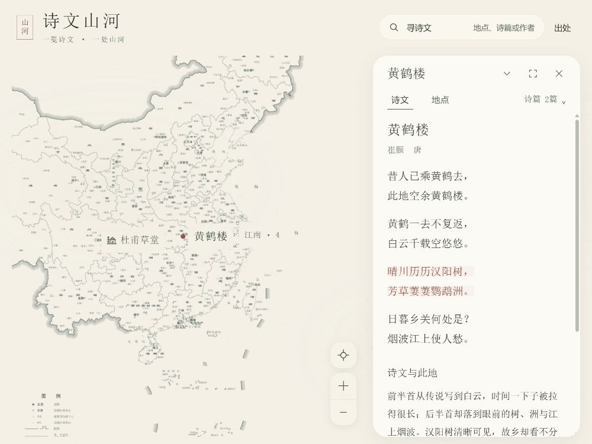

# 诗文山河 · 地图上一页读笺

第十轮完成柔和界面与地图操作统一，正式保留6地点、8作品、8关联。地图仍是首页主体，详情默认关闭；单层读纸、两行紧凑操作、同形地图工具和可恢复的搜索／阅读构成这轮改版。已有雪夜亭舟与钱塘春行意境画保留，原文先于解读与画。



## 本地启动

Node22.12+兼容版本，依赖由lockfile锁定，不需API密钥。地图、worker、原文、画与照片本地打包。

```powershell
cd 'G:\project\数媒\poetic-landscape'
npm ci
npm run dev
```

[开发页面](http://127.0.0.1:5173/)；生产检查与预览：

```powershell
npm run check:data
node scripts/check-design.mjs
node scripts/check-reading.mjs docs/evidence/round10/reading-check.json
node scripts/check-overview.mjs docs/evidence/round10/overview-check.json
node scripts/check-reader-gesture.mjs
npm run build
node scripts/check-reader-layout.mjs docs/evidence/round10
npm run preview
```

[生产页面](http://127.0.0.1:4173/)，端口固定，Ctrl+C停止。check-reader-layout审计本轮已经采集的真实DOM和时序记录，核对当前dist文件名；不会启动浏览器，也不代表重新运行交互。应用改变后须先用本机cua_repl重采受影响证据。手势脚本仅测试吸附／取消纯逻辑，不等于实机触摸。

[第十轮静态ZIP](releases/诗文山河_第十轮静态包_2026-10-07.zip)包括dist全部文件、根index.html。解压后用HTTP服务器运行，不能双击HTML；如已有Python，可在解压目录运行`python -m http.server 8080 --bind 127.0.0.1`。逐文件字节核对与SHA在[release.json](docs/evidence/round10/release.json)及同名[校验文件](releases/诗文山河_第十轮静态包_2026-10-07.sha256.txt)。历史包继续保留。

## 阅读与操作

- 全国PNG＋Panzoom拖缩与近邻组选点；当前地点始终有独立名称与小朱锚点。地图空白可拖动，保留当前阅读。复位名“看全国”，局部名“定位此地”；44px复位与44×88缩放组位于可见地图右下，冲突时移动工具。
- 顶栏“寻诗文”查地名、别名、作者、篇名及主题。命中篇名优先读该篇。目录打开暂隐并inert读案，保留篇目、tab、空间与进度；Esc回旧案，选择结果才新选点。筛选外当前阅读明确标示。
- 地名和收起／展开／关闭在第一行，诗文／地点与选篇在第二行。18px全文连续排布，不嵌套卡片。“收起读案”保留题签，“继续阅读”恢复进度；“展开阅读”进入专注，“恢复大小”回常态。
- 底案抓手／标题非按钮空处可拖三档；低档再下拉不关闭，×才显式退出。抓手上下键进相邻档、Enter循环；正文原生滚动、选文与链接优先。外壳260ms连续插值真实尺寸，快速操作从当前矩形接续，文字不scale。短诗扩容放得下全文时保留原常态锚点。
- ×／读案Esc／首页退出并恢复原探索视野。Esc一次只关最上层：原图、来源、选篇、目录、读案；焦点回相应入口。手动地图拖缩后，继续／专注不会抢回镜头。
- 地点页不自动初始化地图。“查看局部地图”首次才载入L7／MapLibre，后续复用一个组合实例。局部左上“回全国”直接返回；重入保留手动镜头。2张canvas属于同一个组合实例。
- 湖心亭真实照片为Bjoertvedt、2017-07-21、CC BY-SA4.0；原件未改，等比例显示与署名保留。雪夜画只配《湖心亭看雪》，春景只配《钱塘湖春行》，标AI辅助原创意境／非古建复原，苏轼和其他篇不配错图。
- “出处→查看官方原图”最多两点击看完整原件。GS(2023)2763只标原底图身份；原件与衍生处理有台账，成品未送审。
- 出处可开“静观”。`/?overviewFail=1`、`/?mapFail=1`注入地图失败；`/?artFail=1`注入意境画失败；目录及HTML全文仍可读。诊断参数`readerTrace=1`／`motionTrace=1`仅记录DOM；普通页不采样。`/layout-lab`仅是12点隔离规划测试。

## 实测与边界

八尺寸×探索／常态／收起／专注／恢复重新采集。侧案350–420px（短横屏320），手机左右12px；390固定区108px、正文约253px，360正文约232px，原文18px、操作44px。短横屏默认收起；专注由明确操作进入，不算地图主导常态。真实中段矩形、100ms内反向、退出改选、位置记忆、局部单实例、八作品DOM、搜索与故障路径均有新记录。

[设计与截图批评](docs/第十轮设计决策.md) · [实际验收U01–U09](docs/第十轮实际验收记录.md) · [改动说明](docs/第十轮界面与交互改动说明.md) · [证据审计](docs/evidence/round10/layout-budget-check.json) · [总计划v3.0](docs/tasks/诗文山河_MVP开发计划_2026-10-05.md) · [底图台账](docs/官方底图来源与改动说明.md) · [内容与许可](docs/来源与许可.md)。

**G2-layout新回归、G2-ui本轮界面在已测桌面／鼠标／键盘范围开发自测通过，等待独立验收；G1-art沿用已接受继续使用的两画样板，用户终审未完成；G2-map现有PNG粗边与嵌入密城市无法满足目标，成品地图路线尚未通过。** 本轮没有新增地图／画／字体／内容或升级依赖。真实手机触摸与双指、UI pointercancel／拖动中旋转、OS级reduce动态、另一浏览器／设备和干净安装未测；稳定态resize不能冒充旋转中断测试。没有帧率或实耗工时承诺。

本轮未提交、推送或公开部署，停止于6／8范围，不自动开始C1；12／16／17与两卷仍是后续计划。未重试Ghostscript或旧受阻清理。

历史：[第九轮验收](docs/第九轮实际验收记录.md) · [第九轮资产与AI记录](docs/第九轮资产与AI使用记录.md) · [改前README](docs/evidence/round10/README.md.before)。
