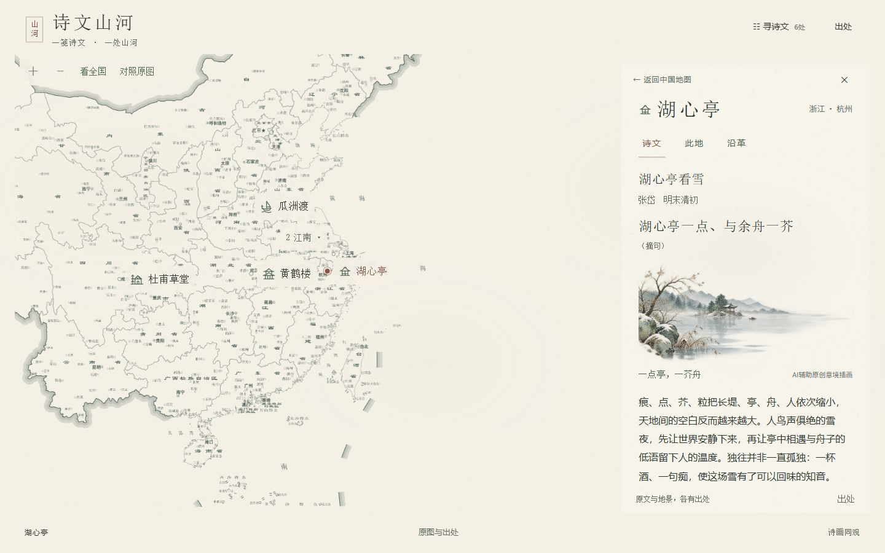
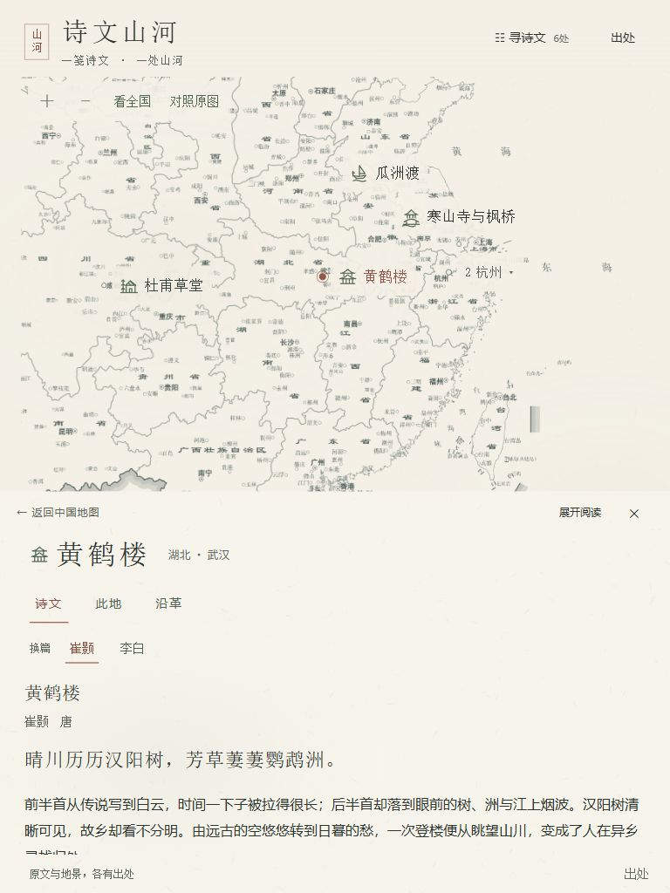
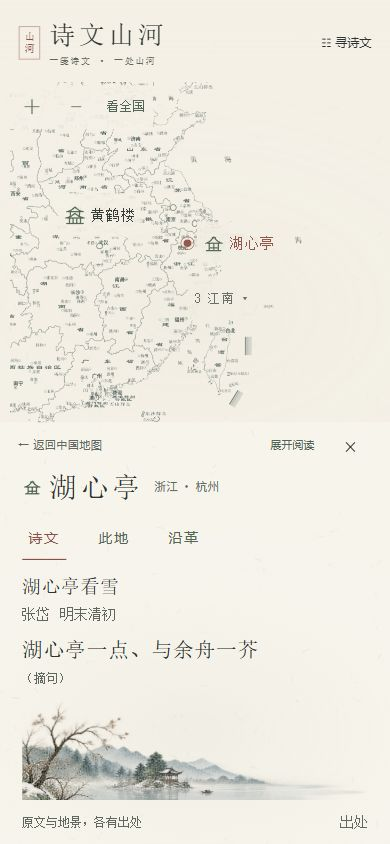

# 第六轮实际验收记录

执行与检查：2026-10-06—2026-10-07，本地Windows／Codex内置Chromium。冻结6地点、8作品、8关联；保留所有既有未提交成果。预算10–14h没有计为实际耗时。无提交、推送或公开部署。

## 结论及证据边界

交互质量收尾已实施，并按本轮受影响路径实际检查；呈现规则已推广至6处阅读、目录、来源和局部工具。G1／G2视觉出口仍待独立／用户认可，地图宋画成品目标尚未获通过。没有物理手机、双指、OS减少动态、跨浏览器或干净安装证据。

实际使用本地frontend-design，设计先于实现；有限修订与真实批评见 [设计决策](第六轮设计决策与交互方案.md)。本轮没有调用imagegen或新增画，复用第五轮有透明通道的湖景。

## I01—I04针对性复测

| 项目 | 实际结果 | 证据 |
|---|---|---|
| I01 长文切标签 | 湖心亭原文打开、scrollTop608；沿革回来608，此地回来仍保留原文开合和已读位置 | evidence/round6/I01-I04.json、long-reading-memory.json |
| I02 键盘换篇 | 两个固定作者按钮保持节点与可见焦点；崔颢380→李白首次0→崔颢380，镜头不变。西湖Enter切白居易再回苏轼；来源分别显示当前李白／白居易作品 | work-memory.json、additional-reading.json |
| I03 最上层Esc | 江南组打开→来源→Esc仅关闭来源，江南组仍开，焦点回来源入口；再Esc关闭组并回原组按钮。覆盖目录与来源互斥，目录关闭回入口 | I01-I04.json、search.json |
| I04 分组键盘 | Enter打开组直接进入首项湖心亭，Esc回原组按钮；选项可选地点，入口消失后回寻诗文 | I01-I04.json、layout12.json |

`before.json`保留改前复现：180→0位置丢失、换篇后BODY焦点、来源Esc被组抢走。以上改后不是由源码推断。

## 连续性与回归

| 路径 | 本轮实测结果／限制 |
|---|---|
| 半屏↔展开，过程中反向 | 纸面从实际位置接续，取消旧WA，matrix比例为1，文字没有整块缩放；反向终态半屏，原文保持打开、位置未归零。短文变高时会受最大scrollTop夹取：崔颢414.67→278；湖心亭608→527.33，不虚记为像素完全一致。另稳定404位置展开／半屏保持404。 |
| 10组快速A→B→关 | 时间戳状态轨迹33条，10组退场均立即inert；最终selected为空，恢复最早探索相机0/0/1，过旧动画期限没有复活。 |
| 镜头中拖动／缩放 | 实际鼠标拖动途中接管scale约1.06133，手动pan后超过旧期限仍保持；锚点随实际图片矩阵逐帧同步。放大／缩小仍可用。 |
| 全国／局部两份记忆 | 返回诗文恢复局部前全国阅读视野，退出阅读恢复自由探索视野；目录、来源、换篇不重新聚焦。相机数学输入不变，24矩阵检查通过。 |
| 局部往返 | 首页canvas0；首次局部mapsCreated1、instance1，2canvas为同一组合实例；手动局部缩放后再入bounds逐字一致，无过渡重建。 |
| 六处八篇 | 全文可展开、8条原文高亮、6处简介／沿革，黄鹤楼与西湖两篇切换；搜苏轼／茅屋／枫桥优先相应作品，楼台筛选联动。 |
| 照片 | 湖心亭署名Bjoertvedt、2017-07-21、CC BY-SA4.0、未修改说明仍见实页。 |
| 静观 | 站内开关实测animation与transition为0s，关闭和焦点行为正常。OS匹配通路有实现，操作系统设置未实测。 |
| 目录／出处过渡 | 进入200ms；关闭即时，不记录为已实现完整退出动效。读案退场220ms立即inert；手机展开300ms，不每帧改height或重建L7。 |
| 地图失败 | `overviewFail=1`与`mapFail=1`各自有明确失败提示；目录进湖心亭、展开完整原文、看到1条高亮仍成功。它是注入失败回归，非真实驱动故障认证。 |
| 开发与生产 | 5173开发首页canvas0、首次局部instance1，生产4173三尺寸与流程实际检查；本次捕获warn/error均为空。 |

原始过程：`continuous-final.json`、`motion-frames-final.json`、`expansion-reversal.json`；连续运行截图 `continuous-selection-start-1440.jpg`／`continuous-selection-drag-1440.jpg`、`continuous-expand-390.jpg`／`continuous-reverse-390.jpg`。这些是带时间戳的连续状态／实际运行帧，未提供录屏，也未以终态截图证明动画对齐。

## 截图与实际尺寸

改前12张与改后15张：1440×900、768×1024、390×844；各为默认总览、湖心亭半屏／侧页、黄鹤楼半屏／侧页、西湖局部，改后另有李白。路径 `screenshots/round6/before-*`、`after-*`。最终拍摄清单记录DOM视口、相机、日期与横向溢出（均false），见 `final-screenshots.json`；影像实际格式／大小／哈希见 `screenshot-manifest.json`。采用同尺寸、同选点与默认展开状态，最终镜头等待motion-state idle；没有把错误尺寸或动画中间帧作为最终对照。

另补12张严格同相机的两实页对照 `matched-before/after-huxin/huanghe-*`：将第五轮交付ZIP解包至隔离临时目录，以本地HTTP只读运行，未恢复覆盖源码；两版选中地点后“看全国”，均为0/0/1完整相机与半屏／侧页。三尺寸实际DOM尺寸和相机逐项一致，清单见 `matched-camera-screenshots.json`，基线包hash见 `comparison-baseline.json`。它们补充原始改前截图，不冒充第六轮实现。

390半屏显示地名、三个标签、篇名作者与至少一句真实连续引句；多篇地点还显示固定作者入口。原文保持HTML与原始关系高亮。正文19/18级仍可读，没有压成12px凑首屏。

12点隔离布局不是内容扩容，三尺寸、敦煌组、楼兰、山海关与玉门关独立选中检查见 [地图路线](第六轮地图路线与呈现定版.md)。坐标／图片锚点只达到有来源的区域布局级，新增景区精度审核尚未完成。

## 性能、检查与静态包

设备：Windows11家庭中文版10.0.26200，Ryzen9 8945H，系统列780M与RTX4060 Laptop；未确定浏览器实际使用哪个GPU。选用`?motionTrace=1`诊断页，在实际RAF读取图像框与当前选中锚点框，169帧最大重投影差0.0136px。间隔中位6.1ms、p95约18.3ms、最长156ms，有3次>50ms间隔；包括自动化／截图开销，不是稳定60FPS或GPU基准声明，也不是long-task观察器结果。原始设备／采样方法与间隔见device.json、performance.json。

`npm run check:data`、`node scripts/check-design.mjs`、24项全国数学检查、TS／Vite生产构建通过。普通git diff检查将历史CRLF报作尾空白；使用`git -c core.whitespace=cr-at-eol diff --check`，修掉main.tsx真实多余空格后通过，没有批量改写历史文件。输出与构建见checks.json。旧轮检查复用冻结输入与许可记录；本轮受影响流程实际重测，未称完整成品矩阵全测。

静态包 [第六轮ZIP](../releases/诗文山河_第六轮静态包_2026-10-07.zip)，26个dist文件逐字节核验、包及每文件SHA-256见release.json。包16,077,730字节，SHA-256为`440739aff6e10283e1fbd84127739280adfb3fe715e02cbba9005ac81a31a367`。需HTTP服务，不能双击HTML运行。启动说明见README。

## 未完成／未验证

- G1／G2用户或独立视觉验收；湖景精细笔法仍有水彩感，全国粗边与密注记受栅格限制。
- EPS矢量整理；无新条件，无重复下载／绕过既有拒绝。
- 新6点现代景区对象精度与正式图片锚点、12／16／17发布内容、主题卷属于阶段C以后。
- 实体手机双指、Safari／Firefox、OS减少动态实际设置、干净冷安装、长期稳定性与真实硬件故障。
- 原图下载回执、成品送审及详细营建年表；保留已有具体缺口，不猜补。
