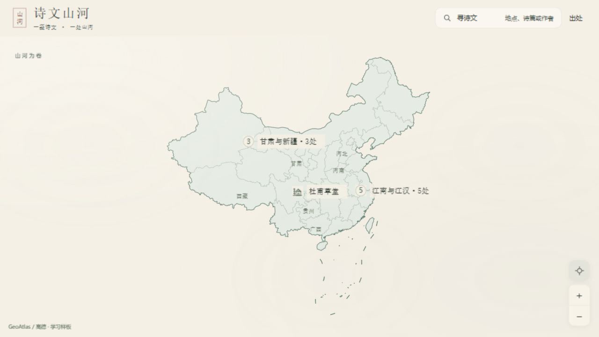
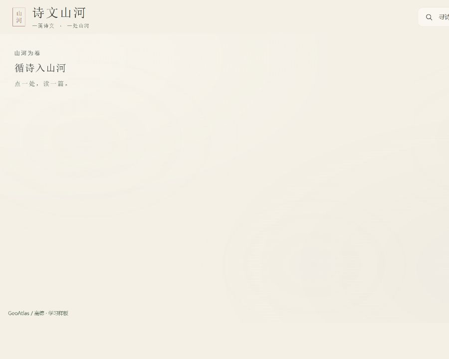
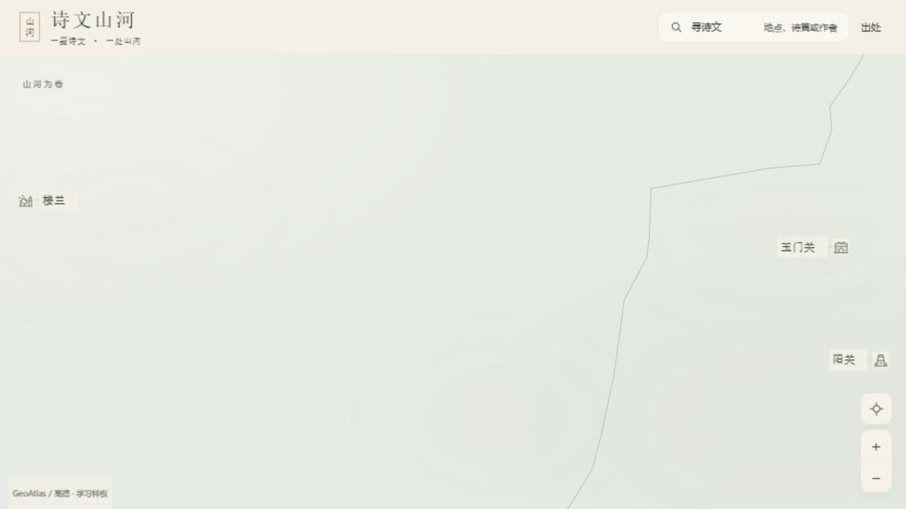
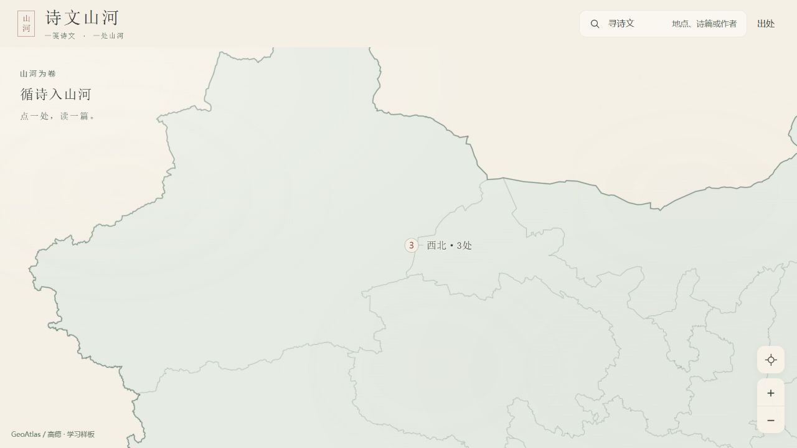
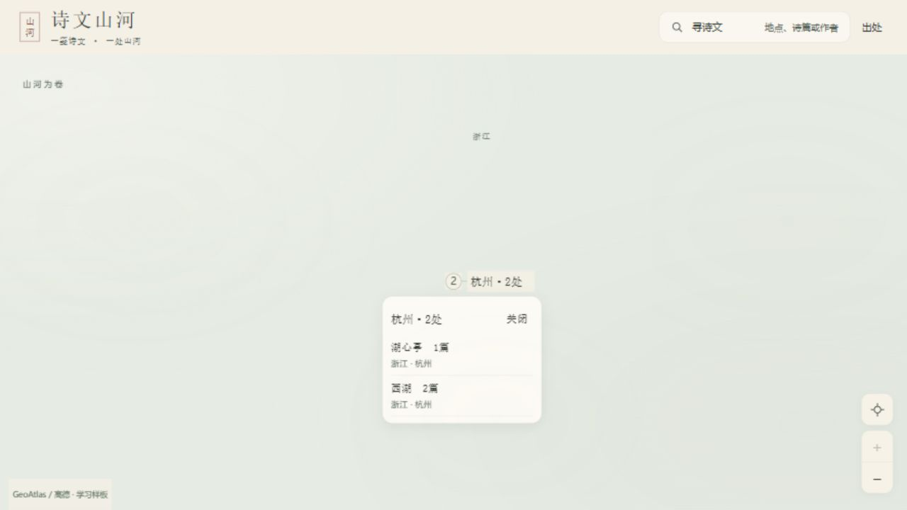
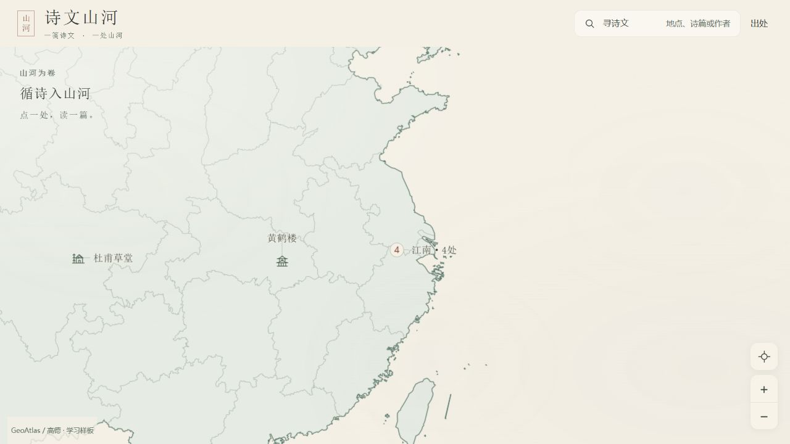
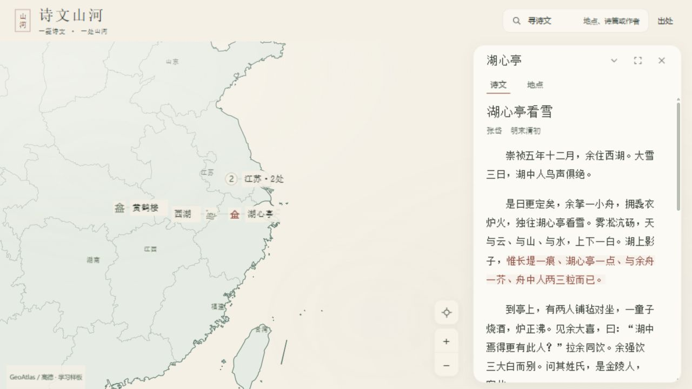
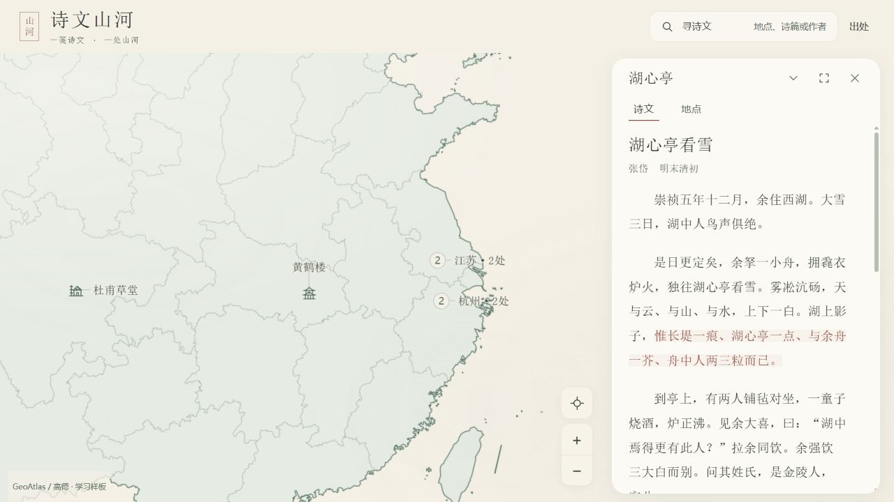
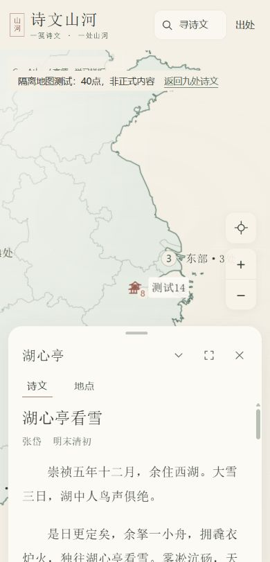
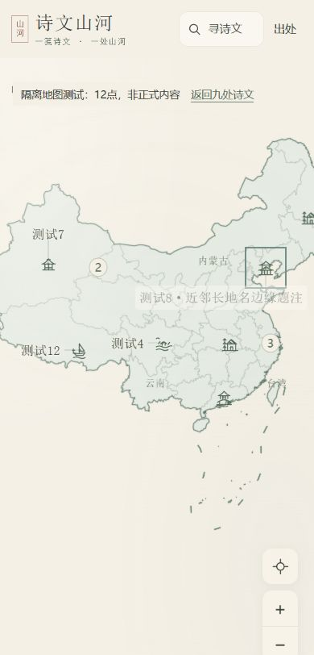

# 第十四轮：真锚点与渐进探索

输入：2026-10-09 MVP v3.8；正式9地点／12作品／12关联冻结。实际读取本地 `C:/Users/13398/.codex/skills/frontend-design/SKILL.md`，采用方案→审查→实现→运行截图批评流程，未调用不存在的技能工具。

## 实施前一页方案

全国地理是主画幅，标签像图中的题注：普通地名直接落墨，当前阅读才有短纸底。类别图标表达地点，计数表达成员数；44px是透明热区而非图形尺寸。楼兰与敦煌先建立区域关系，近邻随后由完整名单解释；不飞到空白的遗址尺度。

色阶沿用：素纸 #F4F0E6、洁纸 #FCFAF4、浓墨 #2E3430、淡墨 #60685E、青墨 #506553、朱墨 #8D5044。宋体承担16px地名和既有18px原文；系统无衬线承担13–14px计数与工具。省名淡墨、文化地名浓墨，左对齐，不引入字体资源。

四态草图（示意信息关系，真实点位不可为构图移动）：

```text
全国            区域                  近邻名单            当前阅读
③ 西北          楼兰  [原锚点]        杭州 · 2处    关闭   亭 湖心亭 [短纸底]
园 杜甫草堂       ② 敦煌              湖心亭   1篇        ｜原文读案
⑤ 江南与江汉    ...文化标签优先...      西湖     2篇        西湖 [近邻入口]
```

全国少量地域和数量；区域完整地名；近邻给真实成员、地区、篇数；选中给当前地点独立身份。湖心亭／西湖、玉门关／阳关、黄鹤楼、杜甫草堂、寒山寺与枫桥、瓜洲渡、楼兰均使用相同规则。

模块职责：稳定成员身份→同坐标／不可靠热区合并→真实字体测量→按优先级复用候选→安全区与文化图标碰撞→省名让位。DOM按地点ID或排序成员集合缓存，不依赖worker cluster_id；内部节点仅初建，文字与状态原位更新。普通图标零偏移。

聚合查询公开getClusterExpansionZoom；单次自动最多约2级，镜头有桌面64px／手机40px文字边距。无法在预算内分解、同坐标或边距不足时直接名单；允许用户明确继续探索，不自动连飞。异步结果须同时拥有源版本、成员、相机意图和输入版本。

## 编码前审查与修订

统一纸条虽然与纸色一致，却把所有名称做成同权重卡片；去掉普通标签矩形与阴影，只为选中／焦点保留短底。泛泛“留白”不能解释全国到敦煌的大跳级，改成可测的单次预算和完整名单。借《宣和画谱》“位置”重于孤立工巧的构图要求，以及《蜡梅山禽图》集中精绘、题款让位的层次；本轮具体转译为文化层先排、省名后排、阅读地点独立，不改地理、不新绘装饰。馆藏观察沿用第十二轮记录，不虚称本轮重新看过原图。

## 改前实页

本轮新采集`before-*`截图和DOM原始记录。1280西北2.680752→7.653761；杭州组到11.5才列名单。390西北1.827456→5.728239、敦煌→9.766275。普通地名有统一纸条，选中近邻用44px整体偏移。输入源码／公共资产／依赖哈希与v3.8快照已单独保存。

## 实现与截图批评

已在内置浏览器检查1280×720、1000×800、390×844正式九点，以及明确标为隔离数据的12／40点。普通题注删除整条矩形底，保留16px宋体与轻护字；选中／焦点才有短纸底、朱色和较重图标线。普通图标在真锚点，44px透明按钮不等于24px物象。省名排布在文化层之后，计数和地域名由实际成员产生。

稳定候选与节点按排序成员集合记忆，worker cluster_id仅用于查询，不是DOM身份。移动中已有Marker继续跟图；停稳后使用当前渲染层、源版本和相机版本重新排布。三次同镜头与五次进退实测候选和nodeSerial一致，约1e-12的经纬度浮差不解释为换位。0.496px最大实页按钮中心误差来自像素取整，没有给地理点永久加44px位移。

### 依据真实截图作的批评与修整

1. 第一版扩到公开分解级后，44px热区合并可能把已分开的成员重新并回，造成点击没有可理解结果。改为分解级后留半级呼吸空间（总预算仍≤2级）；仅当一个中心落入另一热区时共用入口。若分解后成员集合不变，明确打开完整名单。
2. 选中点与中间聚合中心相近，会把杭州和江苏一起吞进当前点。改为先按当前点到真实成员的投影距离提取近邻，当前地名优先；湖心亭保持自己的名称，杭州2处与江苏2处分别出现。真实坐标没有移动。
3. 第一版名单只尝试点旁和四角。40点手机与半屏读案同时显示时，名单仍盖住工具（`stress40-list-reader-390.png`，作为失败样本保留）。增加障碍边缘候选及逐步缩短滚动区，修整图`corrected-stress40-list-reader-390.png`中的名单位于左上可用带，工具、读案、两个锚点均露出；关闭44px留在固定头部，8个成员可滚动到末项。
4. 冷加载曾同时读到父聚合与单点，楼兰被重复计入。改为当前渲染层查询，等待源与引擎idle，并按成员唯一归属消重。9／12／40的全国入口计数均与唯一成员数对应。
5. 高倍返回全国实测发现飞行中不断刷新maxBounds使缩小提早结束。只在原生缩放中同步边界，自动意图结束后再同步；11.5→2.680752完整返回已实测。没有改变既有相机计算公式。
6. 地图故障回归发现历史图片只有六处锚点，却投影新增三地的undefined值。只跳过无锚点项目，不造图片坐标；九地仍可通过目录阅读。修复前错误记录与修复后空控制台分别存档。
7. 追加真正靠边的原生拖动检查时，焦点长名的六个常规候选都被边界或另一图标挡住（`accepted-stress12-edge-left-390`的candidate=null是失败样本）。补充仅用于required题注的夹边上下候选和障碍边缘候选；修整后`corrected-stress12-edge-focus-390`中图标仍约x330，完整名称在x168–382内显示，短引线对应原锚点。没有让全部普通文字强制重叠。

### 前后对应

| 图面 | 改前观察 | 本轮实页结果 |
|---|---|---|
| 1280全国 | 统一矩形纸条、9成员 | 同完整2.680752视野，墨字／轻护字，文化层优先 |
| 1280西北 | 2.680752→7.653761 | →4.5，楼兰与敦煌2可识别；再点敦煌直接完整名单 |
| 390西北 | 1.827456→5.728239，敦煌再→9.766275 | →3.5；敦煌不再飞远，名单包含阳关和玉门关 |
| 1280杭州名单 | 到11.5才出现 | 3.5→4.5→名单；每次自动≤2级 |
| 1280选中读案 | 湖心亭4.680752，普通邻点有整体偏移 | 同镜头／同读案状态，湖心亭独立朱色题注，邻点零偏移 |
| 390选中／名单 | 一律纸条，名单容易挤工具 | 当前名独立；名单按实测空位缩短滚动区，工具44px保留 |

部分调试记录是在读案关闭动画未结束、resize后未刷新操作坐标或原生事件尚未交付时取得，保留而未纳入最终稳定态审计。最终清单见`evidence/round14/runtime-audit.json`，并不把moving帧当最终相机。早期`stress12/40-*`样本检查文化层规则，后续只调整名单空位与故障层；最后ZIP烟测和HTTP字节检查使用最终构建。












### 自评边界

普通标签的卡片感已明显减弱，疏密由优先级和图面预算形成；selected与focus的短底承担含义，未新增装饰。手机半屏正文仍18px，可读原文保持在首屏。40点全部全文标签不同时铺开，隐藏文字仍有aria全名与焦点优先显示。低倍地理不会凭空长出道路／古建，西北空处由真实范围决定。馆藏规则转译与界面层级是开发自评，用户审美终审、另一浏览器和实机触摸仍未测；不以功能用例代替艺术终审。
